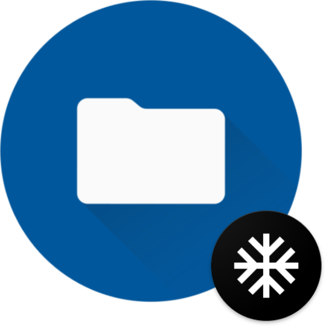
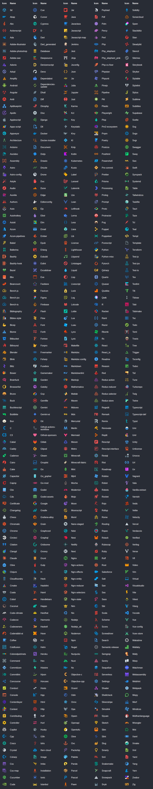
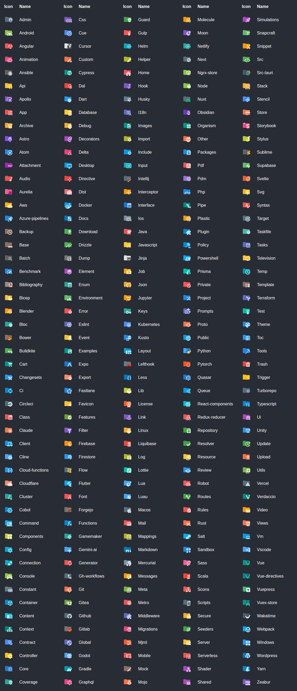

  

<h1 align="center">Material Icon Theme</h1>

<em>Material Design icons for Xed-Editor</em>

### File icons

<b>Show all available file icons</b>
 

### Folder icons

<b>Show all available folder icons</b>
 

 

## Getting Started

1. Download the latest release [here](https://github.com/KonerDev/xed-material-icon-theme/releases/latest)
2. Open Xed-Editor and go to `Settings` > `Themes` > `+ Add icon pack`
3. Select the downloaded ZIP file
4. Apply the icon pack by selecting it in the list

## License

This project is licensed under the MIT License.
See the [LICENSE](LICENSE) file for more details.

## Credits

This icon theme is a port of the popular [Material Icon Theme](https://github.com/material-extensions/vscode-material-icon-theme) for Visual Studio Code, created by [Philipp Kief](https://github.com/PKief).
